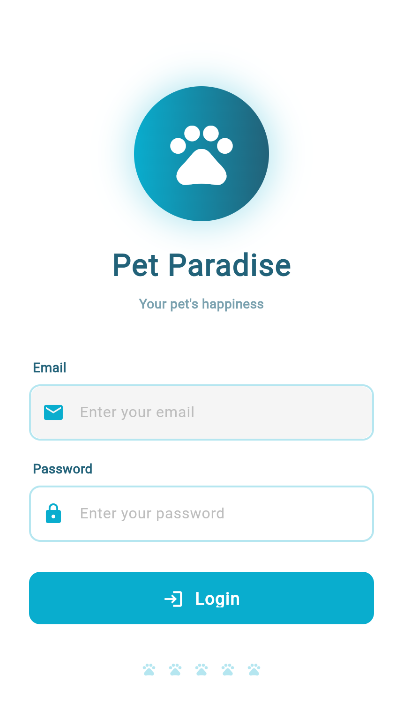
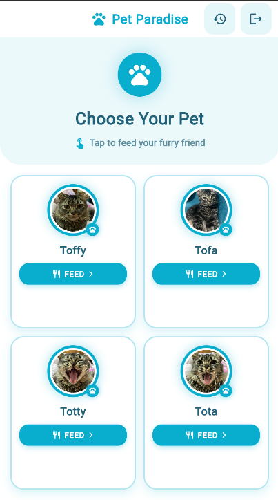
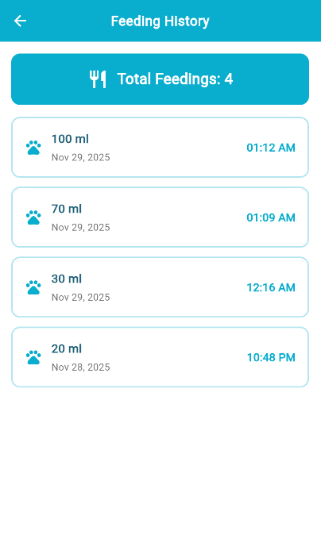
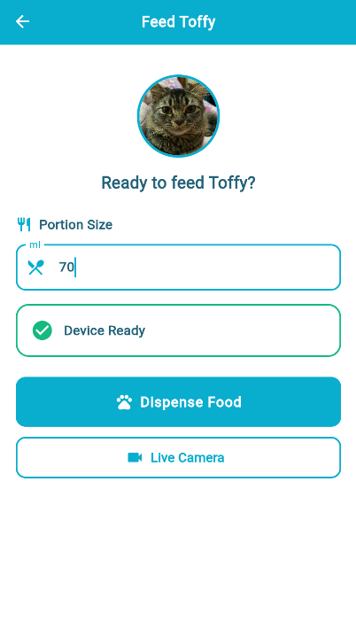

# Pet Paradise : A Smart Pet Feeder 🐾

An intelligent IoT-enabled pet feeding system designed to ensure your pet is fed on time, track consumption, and provide real-time monitoring. Built for pet owners with busy schedules, frequent travelers, or disabilities, this solution combines hardware, mobile apps, and AI for reliable and automated pet care.

---

## Problem Statement

Pet owners face multiple challenges:  

- **Busy routines**: Late meetings, traffic, or social events disrupt feeding schedules.  
- **Frequent travelers**: Ensuring consistent care while away is a logistical challenge.  
- **Physical hurdles**: Owners with disabilities may struggle with manual feeding.  

**Current solutions** are expensive (~7,000 EGP) and often lack monitoring and intelligence.  

---

## Our Solution

The **Smart Feeder** is an intelligent hub for your pet's care, engineered for reliability and peace of mind.  

### Key Features

- **Precision Scheduling**: Automate feeding times with exact portion control.  
- **Real-Time Monitoring**: Camera-enabled verification ensures your pet actually eats.  
- **Consumption Tracking**: Track how much your pet consumes over time.  
- **AI Identification**: Machine learning determines pet presence in food bowl.  
- **Remote Control**: Operate and monitor the feeder from your Flutter mobile app.  
- **Affordable & Reliable**: Engineered with ESP32 microcontroller for seamless IoT integration.  

---

## App Screens
<table>
  <tr>
    <td align="center">
     Login Screen <br>
      
    </td>
    <td align="center">
      Home Screen<br>
      
    </td>
  </tr>
  <tr>
    <td align="center">
      Feeding History<br>
      
    </td>
    <td align="center">
      Feed Pet Screen<br>
      
    </td>
  </tr>
</table>


---

## System Architecture

**Device Layer**  
- ESP32-CAM  
- Servo Motor for dispensing  
- Load Cell for food weight measurement  
- Speaker for notifications  

**Software Layer**  
- **Mobile App**: Flutter (cross-platform)  
- **Backend**: Firebase Authentication & Realtime Database  
- **AI / ML**: Python + OpenCV for pet detection and consumption tracking  

---

## How It Works

1. **Smart Food Dispensing**: Set portion sizes in the mobile app.  
2. **Live Monitoring**: Feeder captures an image when dispensing food.  
3. **AI Verification**: Cloud ML model classifies if the pet is present and has eaten.  
4. **Data Logging**: Food portion and consumption logs stored in Firebase.  
5. **Remote Alerts**: Users receive real-time updates on feeding events.  

---

## Tech Stack

**Hardware**  
- ESP32 / ESP32-CAM  
- Servo Motor  
- Load Cell (HX711)  

**Software**  
- Flutter (Mobile App)  
- Firebase (Auth & Realtime Database)  
- Python + OpenCV (AI / ML Logic)  

---

## Installation

1. Clone the repository:  
```bash
git clone https://github.com/Mayamohamed207/pet_feeder_app.git
cd pet_feeder_app
